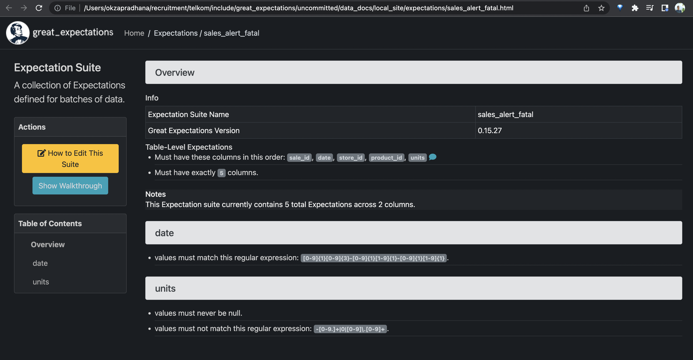

# Assessment

## Setup Airflow
By following these [instructions](https://airflow.apache.org/docs/apache-airflow/stable/howto/docker-compose/index.html). Using Airflow 2.4.1

Or you can simply run `docker-compose up airflow-init` then `docker-compose up -d` after cloning the project and create `.env` that mentioned in the docs.

## Restore Chinook Tables and HR Tables

Chinook (PostgreSQL)
```
psql -h <hostname> -U <username> -d <database-name> -f ~/path/to/chinook_pg.sql
```

Human Resource (MySQL)
```
mysql -u <username> --host=<hostname> --port=<port> <dbname> -p < ~/path/to/human_resources_mysql.sql
```

# Task 1
## Data Modelling


## DAG


# Task 2
## DAG


## Tables


# Task 3
Setup Great Expectations [here](https://docs.greatexpectations.io/docs/tutorials/getting_started/tutorial_overview).

The project is stored at `include/great_expectations`.

## DAG
To copy/upload local files stored at `data/*` to GCS and create table from those GCS files.


## Expectations
### Inventory


### Products


### Sales


### Stores


## Checkpoint Result Samples


